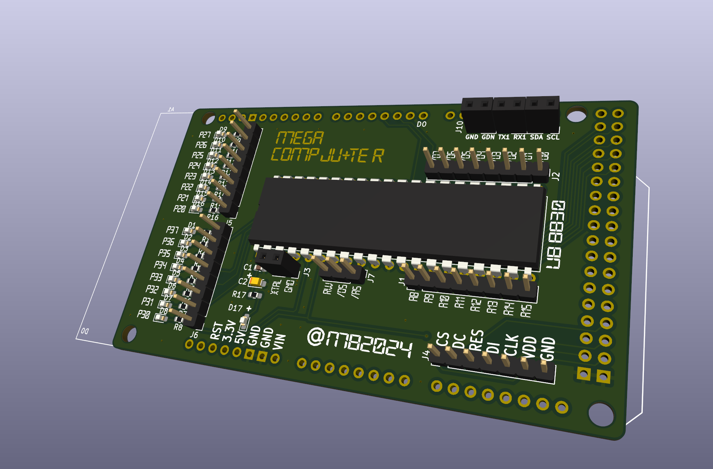

# MEGA CompJU+TEr

# Status

Just an Idee.

# Wath's this ?

Arduino MEGA Shield with a UB8830 on top.

A bit like these things... http://8bitforce.com/projects/retroshield/

# Refs

https://github.com/boert/JU-TE-Computer

https://hc-ddr.hucki.net/wiki/doku.php/tiny/dokumentation 

https://www.robotrontechnik.de/html/forum/thwb/showtopic.php?threadid=16374

https://hackaday.com/2020/07/17/a-z80-board-with-very-few-parts/
