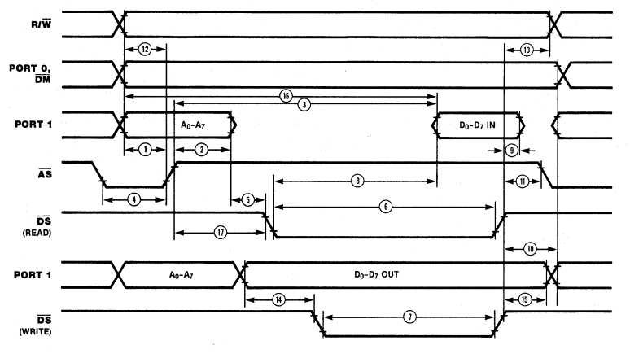

# MEGA CompJU+TEr

# Status

Just an Idee. Made a basic PCB. Started experimenting...

# Wath's this ?

Arduino MEGA Shield with a UB8830 on top. The UB8833 is a Ostblock version of a Zilog Z8682 with a view quirks.

A bit like these things... http://8bitforce.com/projects/retroshield/ [Or here the Z80 code](https://gitlab.com/8bitforce/retroshield-arduino/-/blob/master/kz80/kz80_test/kz80_test.ino?ref_type=heads)

### Bugs / Improvements

* UB8833 reset(pin6) to some pin(45) ! keep it low until all ports initialize.
* LEDs for AS,RW,DS ?
* Fuse ? The Z8 needs 180mA !?

# Software

From Z8 datasheet...

* When AS goes LOW->HI latch the low adr byte. And read and keep RW flag.
* When DS goes HIGH->LOW and RW is reading (HIGH) put data on the bus. 
* When DS goes low and writing, read the data, do something e.g. save to ram.
* Turn of Data output ??? When ??? Read data to DS 1 hold time is 0, so turn it off after DS goes high.

### First something ?

after applying reset for at least 3 clocks it started doing things
* AS, DS, RW go up and down
* But no data on the bus !? -> could the thing be running it's internal ROM first ? Then there should be a addr=0x0800 (ext reset vector) comming up some time.. When it reads 0 it would start @0 again ???
* Oszi say it starts reading and writing to 0x1012 after about 173 initial clocks. it writes 0xff ?

# PCB

| ATMega Pin Port | UB8833 | Comments |
|---|---|---|
| PA | AdrHi | hi adr byte |
| PC | AdrLow/Data bus | multiplexed Data/Adr bus |
| | | |
| D2(int0) | AS | Adr strobe, Lo->Hi store the low adr |
| D3(int1) | DS | Data strobe, ?? |
| | | |
| D46/PL3(pwm pin) | XTAL | Clock |
| D47/PL2 | RW | Read/Write indication |

| ATMega Pin | Display |
|---|---|
| D53 | CS |
| D49 | DC |
| D51(mosi) | DI |
| D52(sclk) | CLK |

# Refs

https://github.com/boert/JU-TE-Computer

https://hc-ddr.hucki.net/wiki/doku.php/tiny/dokumentation 

https://www.robotrontechnik.de/html/forum/thwb/showtopic.php?threadid=16374

https://hackaday.com/2020/07/17/a-z80-board-with-very-few-parts/

http://bitsavers.informatik.uni-stuttgart.de/components/zilog/z8/Z8681_Data_Sheet_Mar83.pdf
